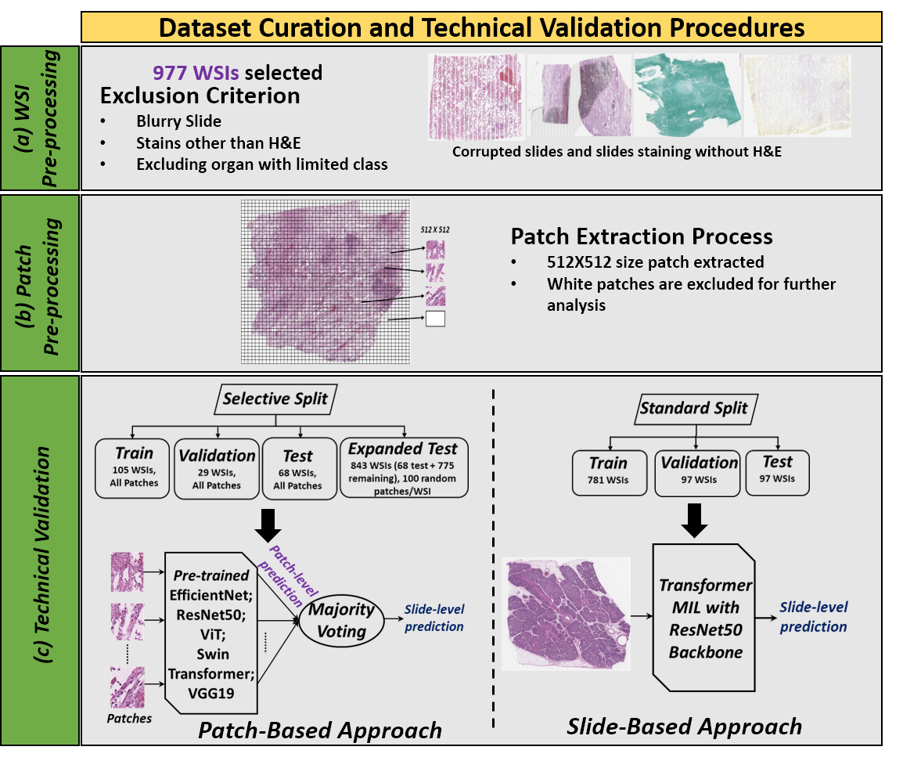
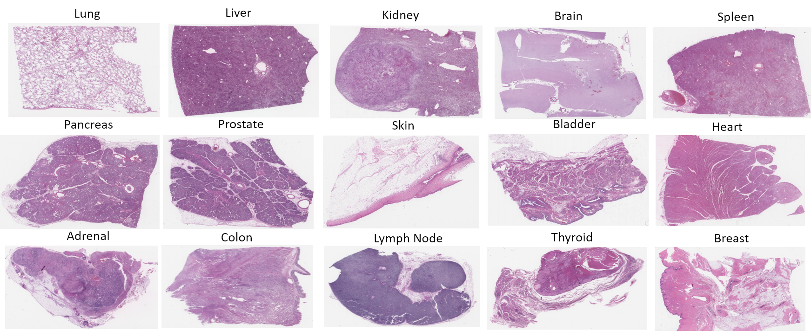

# UCF-MultiOrgan-Path: A Public Benchmark Dataset of Histopathologic Images for Deep Learning Model Based Organ Classification

## Dataset Description

### Paper Reference
**Title**: UCF-MultiOrgan-Path: A Public Benchmark Dataset of Histopathologic Images for Deep Learning Model Based Organ Classification  
Authors: By Md Sanzid Bin Hossain, Yelena Piazza, Jacob Braun, Anthony Bilic, Michael Hsieh, Samir Fouissi, Alexander Borowsky, Hatem Kaseb, Amoy Fraser, Britney-Ann Wray, Chen Chen, Liqiang Wang, Mujtaba Husain, and Dexter Hadley 

### Abstract
A pathologist diagnoses diseases by examining tissue slides under a microscope. The entire tissue specimen can be digitally stored as a Whole Slide Image (WSI). However, diagnosing large volumes of WSIs manually is time-consuming and requires expertise. Deep learning offers a promising approach to automate disease diagnosis in histopathology. **UCF-MultiOrgan-Path** is a dataset designed to support research in digital pathology, providing nearly 1,000 WSIs and over 2.38 million patches for 15 organ classes. This dataset serves as a benchmark for developing and validating organ classification models.

 

### Dataset Composition
- **Whole Slide Images (WSIs)**: 977 WSIs at 20x magnification.
- **Image Patches**: Approximately 2.38 million 512x512 patches extracted from the WSIs.
- **Organ Classes**: Lung, Liver, Kidney, Brain, Spleen, Pancreas, Prostate, Skin, Bladder, Heart, Adrenal, Colon, Lymph Node, Thyroid, Breast.

## Dataset
Our dataset is available on the following [link](https://stars.library.ucf.edu/ucfnecropsywsi/). Dataset contains 15 organ classes. A sample WSI image of each Organ class is provided in the following Figure.

 

## Code
1. Code to run the patch extraction can be found in the following [Google Colab notebook](Patch_batch_processing.ipynb)
2. Code to run the classification task can be found in the following [Google Colab notebook](UCF_WSI_Classification_model.ipynb)
